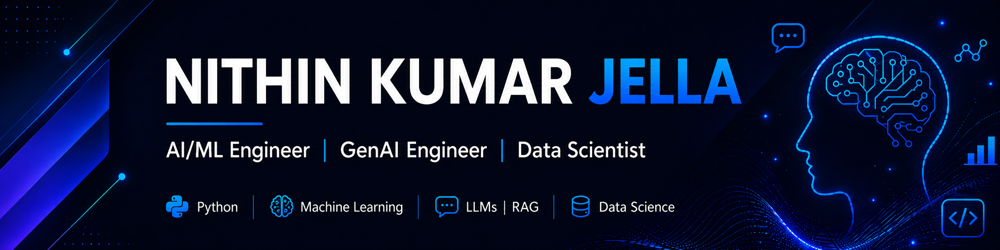

<h4 align="center">Hi, I'm Nithin Jella 👋</h4>
<h5
<p align="center">
  
</p>
<p align="center">
  <a href="https://www.linkedin.com/in/nithin-kumar-jella-031883322/">
    
  </a>
  <a href="YOUR_RESUME_LINK">
    
  </a>
  <a href="https://www.linkedin.com/in/nithin-kumar-jella-031883322/">
    
  </a>
  <a href="https://github.com/nithin-jella">
    
  </a>
  <a href="mailto:nithink.jella@gmail.com">
    
  </a>
</p>
<p align="center">
Master's in Data Science @ University of Houston  
<br>
<br>
Open to Data Science, AI/ML Engineering, GenAI, Data Engineer, and Data Analytics opportunities
</p>

______________________________________________________________________________________________________________________

## About Me

I am currently pursuing my Master’s in Engineering Data Science at the University of Houston with a 4.0 GPA. My professional journey began in Data Science roles where I focused on building scalable systems, automating manual processes, and improving data reliability through structured validation. These early experiences with CI/CD pipelines, testing frameworks, and automation tools laid the technical foundation that I now apply to more advanced data and AI problems.

I enjoy building AI and data-driven systems that solve practical problems through machine learning, NLP, analytics, and intelligent automation. My work focuses on combining strong technical foundations with real-world impact across healthcare, finance, and applied AI systems.  I enjoy taking messy, ambiguous problems and designing clean, structured solutions that are easy to understand and implement. 

I am most excited by opportunities in data science, ML engineering, GenAI, and analytics engineering where strong technical work translates into clear business or user impact.

---

## Education


**University of Houston** — 
<br>
*Master of Science, Engineering Data Science* (Dec 2020  -  May 2026)  
 • Natural Language Processing, Artificial Intelligence for Engineers, Data Science, Probability & Statistics, Machine Learning, Data Mining for Engineers, Database Management Tools, Digital Image Processing, Data Analysis in Construction Management, Data Analytics for Engineering Management

<br>

**CVR College of Engineering** — 
<br>
*Bachelor of Technology, Electrical and Electronics Engineering* (Aug 2024 - June 2024)  
**Minor:** Internet of Things  
 • Python, C++, Cloud Computing, Smart Technologies, IoT Automation with Raspberry Pi, Fog & Edge Computing for IoT

---
## What Sets Me Apart

- I focus on **real-world deployment and impact**
- I build **end-to-end systems**, not just models
- I combine **AI, data engineering, and analytics** into usable product
---

## Tech Stack
**Languages:** Python, SQL, JavaScript  
**AI/ML:** Machine Learning, Deep Learning, NLP, LLMs, RAG, Fine-tuning  
**Frameworks:** Scikit-learn, PyTorch, TensorFlow, LangChain  
**Data Tools:** Pandas, NumPy, Matplotlib, Power BI  
**Databases:** MySQL, PostgreSQL, MongoDB, ChromaDB  
**Tools:** GitHub, VS Code, Docker, Google Colab

---

## Featured Project
### Commonsense-Driven Fine-Tuning of Transformer Models for Coherent Story Generation
An NLP and Generative AI project that fine-tunes transformer models using LoRA to generate coherent short stories.  
The project evaluates results using BLEU, ROUGE, BERTScore, and Perplexity.

---

## GitHub Stats
<p align="center">
  
</p>
<p align="center">
  
</p>


## Connect With Me
<p align="center">
  <a href="https://www.linkedin.com/in/nithin-kumar-jella-031883322/">LinkedIn</a> •
  <a href="YOUR_PORTFOLIO_LINK">Portfolio</a> •
  <a href="mailto:nithink.jella@gmail.com"">Email</a>
</p>
```
</h5>

